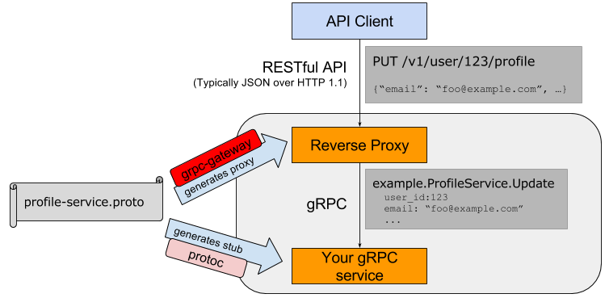

# go-grpc-tutorial
This tutorial provides a basic Go programmer's introduction to working with gRPC.

## Goal of this tutorial
* Define a service in a .proto file.
* Generate server and client code using the protocol buffer compiler.
* Use the Go gRPC API to write a simple client and server for your service.

## 1. Prerequisites

This requires Go 1.6 or later, ProtocolBuffers 3.0.0 or later

```
// Ubuntu 16.04
$sudo apt install libprotobuf-dev
```

Requires that GOPATH is set

```bash
$ go help gopath
$ # ensure the PATH contains $GOPATH/bin
$ export PATH=$PATH:$GOPATH/bin
# for fish guy :)
# set -gx PATH $PATH $GOPATH/bin
```
Then, go get -u as usual.

```bash
go get google.golang.org/grpc
go get -u github.com/golang/protobuf/{proto,protoc-gen-go}
go get -u github.com/grpc-ecosystem/grpc-gateway/protoc-gen-grpc-gateway
```

## 2. Guidelines



Figure1. architecture of our example program

Make sure that your ```$GOPATH/bin``` is in your ```$PATH```.

### 2.1 Define your service in gRPC

pb/service.proto:

```proto
syntax = "proto3";
option go_package = "echo";

// Echo Service
//
// Echo Service API consists of a single service which returns a message.
package echo;

import "google/api/annotations.proto";

// Message represents a simple message sent to the Echo service.
message Message {
	// Id represents the message identifier.
	string id = 1;
	// The message to be sent.
	string msg = 2;
}

// Echo service responds to incoming echo requests.
service EchoService {
	// Echo method receives a simple message and returns it.
	// The message posted as the id parameter will also be returned.
	rpc Echo(Message) returns (Message) {
		option (google.api.http) = {
			post: "/v1/example/echo/{id}/{msg}"
		};
	}
}
```

### 2.2 Generate gRPC stub

Generating client and server code
```bash
$ protoc -I/usr/local/include -I. \
  -I$GOPATH/src \
 -I$GOPATH/src/github.com/grpc-ecosystem/grpc-gateway/third_party/googleapis \
 --go_out=google/api/annotations.proto=github.com/grpc-ecosystem/grpc-gateway/third_party/googleapis/google/api,plugins=grpc:. \
  pb/service.proto
```

Generate reverse-proxy for your RESTful API
```bash
$ protoc -I/usr/local/include -I. \
   -I$GOPATH/src \
   -I$GOPATH/src/github.com/grpc-ecosystem/grpc-gateway/third_party/googleapis \
   --grpc-gateway_out=logtostderr=true:. \
   pb/service.proto
```

### 2.3 Write your Server code

server/server.go:

```golang
package main

import (
	"flag"

	"github.com/golang/glog"
	pb "github.com/go-grpc-tutorial/pb"
	"golang.org/x/net/context"
	"google.golang.org/grpc"
	"net"
)

// Implements of EchoServiceServer

type echoServer struct{}

func newEchoServer() pb.EchoServiceServer {
	return new(echoServer)
}

func (s *echoServer) Echo(ctx context.Context, msg *pb.Message) (*pb.Message, error) {
	glog.Info(msg)
	return msg, nil
}

func Run() error {
	listen, err := net.Listen("tcp", ":50051")
	if err != nil {
		return err
	}
	server := grpc.NewServer()
	pb.RegisterEchoServiceServer(server, newEchoServer())
	server.Serve(listen)
	return nil
}

func main() {
	flag.Parse()
	defer glog.Flush()

	if err := Run(); err != nil {
		glog.Fatal(err)
	}
}
```


server/server-rproxy.go: (REST JSON API)

```golang
package main

import (
	"flag"
	"net/http"
	"github.com/grpc-ecosystem/grpc-gateway/runtime"
	"github.com/golang/glog"
	pb "github.com/go-grpc-tutorial/pb"
	"golang.org/x/net/context"
	"google.golang.org/grpc"
)

var (
	echoEndpoint = flag.String("echo_endpoint", "localhost:50051", "endpoint of EchoService")
)

func RunEndPoint(address string, opts ...runtime.ServeMuxOption) error {
	ctx := context.Background()
	ctx, cancel := context.WithCancel(ctx)
	defer cancel()

	mux := runtime.NewServeMux(opts...)
	dialOpts := []grpc.DialOption{grpc.WithInsecure()}
	err := pb.RegisterEchoServiceHandlerFromEndpoint(ctx, mux, *echoEndpoint, dialOpts)
	if err != nil {
		return err
	}

	http.ListenAndServe(address, mux)
	return nil
}

func main() {
	flag.Parse()
	defer glog.Flush()

	if err := RunEndPoint(":8080"); err != nil {
		glog.Fatal(err)
	}
}
```


### 2.3 Client Side

server/client.go:

```golang
package main

import (
	"log"
	"os"

	"golang.org/x/net/context"
	"google.golang.org/grpc"
	pb "github.com/go-grpc-tutorial/pb"
)

const (
	address = "localhost:50051"
	defaultName = "PhuongDV"
)

func main() {
	// Set up a connection to the server.
	conn, err := grpc.Dial(address, grpc.WithInsecure())
	if err != nil {
		log.Fatalf("did not connect: %v", err)
	}
	defer conn.Close()
	c := pb.NewEchoServiceClient(conn)

	// Contact the server and print out its response.
	name := defaultName
	if len(os.Args) > 1 {
		name = os.Args[1]
	}
	r, err := c.Echo(context.Background(), &pb.Message{Id: "1", Msg: name})
	if err != nil {
		log.Fatalf("could not greet: %v", err)
	}
	log.Printf("Greeting: %s", r.Msg)
}

```


### 2.4 Try it out!

 To compile and run the server, assuming you are in the folder ```$GOPATH/src/github.com/go-grpc-tutorial```, simply:
```bash
 $ go run server/server.go
 ```

 Likewise, to run the client, in a new shell:
```bash
 $ go run client/client.go

 017/03/06 17:36:33 Greeting: PhuongDV
```

You can also run the proxy in a new shell:
```bash
 $ go run server/server-rproxy.go

 017/03/06 17:36:33 Greeting: PhuongDV
```

Call REST API

```bash
 $ curl -X POST "http://localhost:8080/v1/example/echo/1/PhuongDV"

{"id":"1","msg":"PhuongD"}
```


## 3. Source code


Download the entire example from https://github.com/phuongdo/go-grpc-tutorial, then copy it
to ```$GOPATH/src/github.com/go-grpc-tutorial```

## 4. Further reading

* gRPC quickstart (http://www.grpc.io/docs/quickstart/go.html)
* gRPC advance (http://www.grpc.io/docs/tutorials/basic/go.html#generating-client-and-server-code)
* grpc-gateway a plugin of protoc (https://github.com/grpc-ecosystem/grpc-gateway/)
